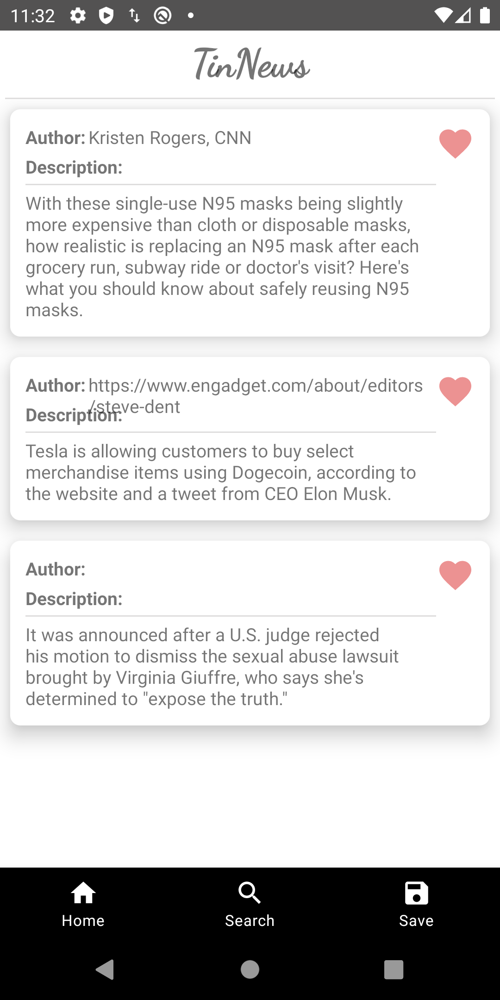
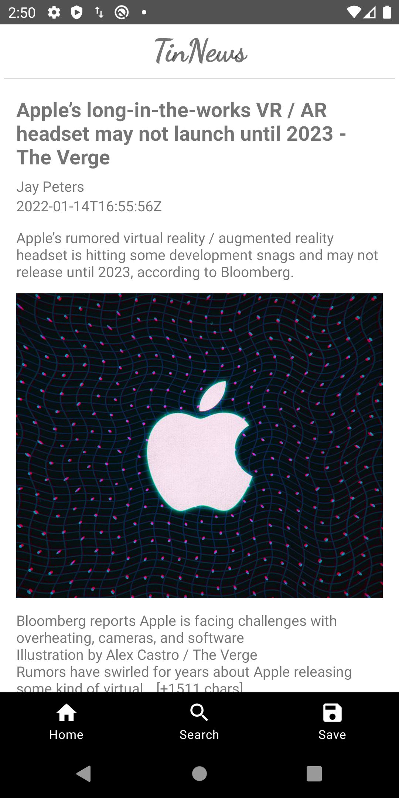
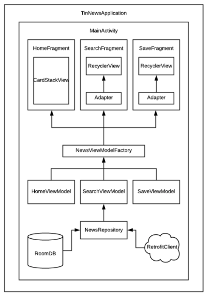
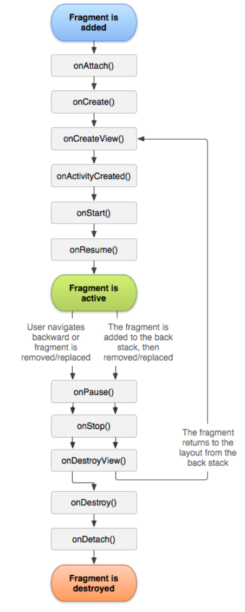
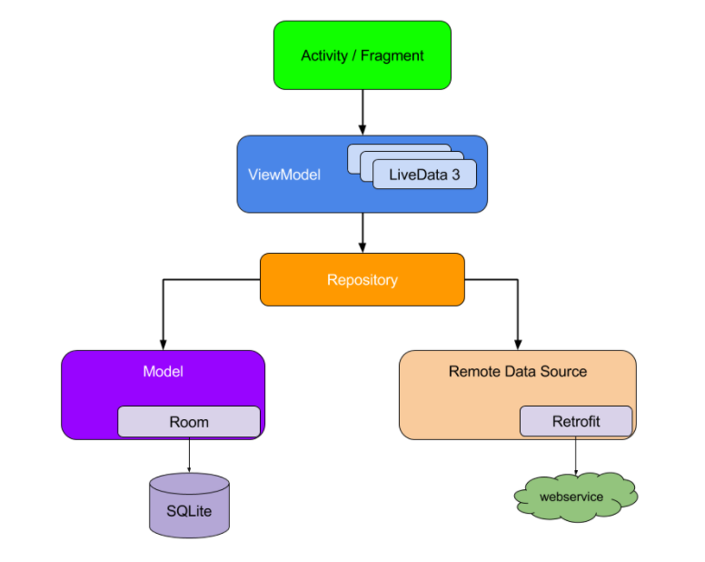

# TinNews

## Personalized News Recommendation Android App

This News app allows users to like or skip the news, search news, and recommend news for users based on their locations. 

 

## Architecture

## Lifecycle

Activity & Fragment Lifecycle

## Network

Integrated Retrofit and LiveData to pull the latest news data from a RESTFUL endpoint ([https://newsapi.org/](https://newsapi.org/)).

## MVVM pattern

The app was designed based on Google Component Architectural MVVM Pattern. MVVM stands for Model-View-ViewModel. Android provides MVVM support built into the ecosystem with Jetpack. 

## Recycler View

It implemented the bottom bar & page navigation using the JetPack navigation component. Using 3rd party CardStackView (RecyclerView), it achieved swipe gestures for liking/disliking the news.

If your app needs to display a scrolling list of elements based on large data sets (or data that frequently changes), you should use RecyclerView.

- RecyclerView.Adapter - It tells the recycler when to create view and when to bind data with the view.
  - Create a ViewHolder to wrap view for reusage.
- LayoutManager - A LayoutManager is responsible for measuring and positioning item views within a RecyclerView.
  - It supports three types of layout: Linear, Grid, StaggerGrid 
- ItemAnimator - Helps with animating the items for common operations such as Addition or Removal of item

## Local Database with Room

Room Database with LiveData & ViewModel to assist local cache and offline models. 
The Room contains the database holder and serves as the main access point for the underlying connection to your app’s persisted, relational data. 
Room provides an abstraction layer over SQLite to allow fluent database access while harnessing the full power of SQLite. Apps that handle non-trivial amounts of structured data can benefit greatly from persisting that data locally. The most common use case is to cache relevant pieces of data. That way, when the device cannot access the network, the user can still browse that content while they are offline. Any user-initiated content changes are then synced to the server after the device is back online.

- Database: Contains the database holder and serves as the main access point for the underlying connection to your app’s persisted, relational data.
- An entity represents a table within the database. 
- DAO contains the methods used for accessing the database.

