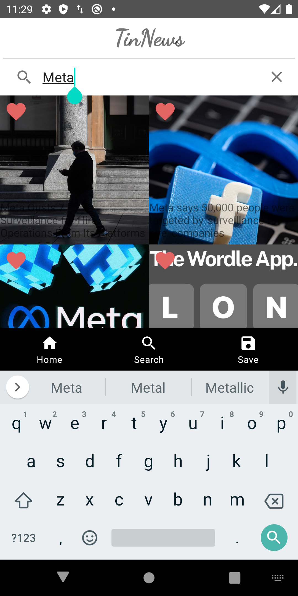

# TinNews

## Personalized News Recommendation Android App

This News app allows users to like or skip the news, search news, and recommend news for users based on their locations. 

## MVVM pattern

The app was designed based on Google Component Architectural MVVM Pattern. MVVM stands for Model-View-ViewModel. Android provides MVVM support built into the ecosystem with Jetpack. 

It implemented the bottom bar & page navigation using the JetPack navigation component. Using 3rd party CardStackView (RecyclerView), it achieved swipe gestures for liking/disliking the news. 

Implemented the bottom bar & page navigation using JetPack navigation component

Utilized Mindorks’s PlaceHolderView to support swipe gestures for liking/disliking the news

Built the Room Database with LiveData & ViewModel to support local cache and offline model

Integrated Retrofit and Rxjava to pull the latest news data from a RESTFUL endpoint (newsapi.org)

